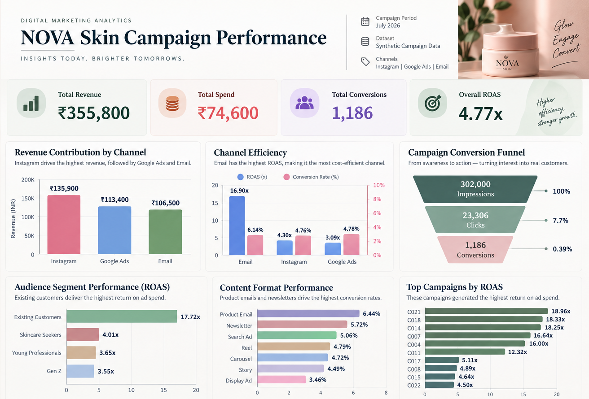
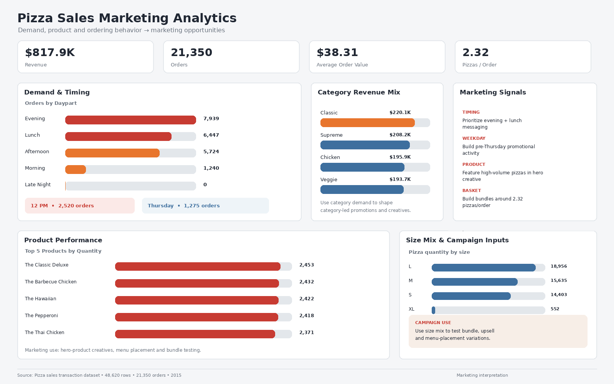
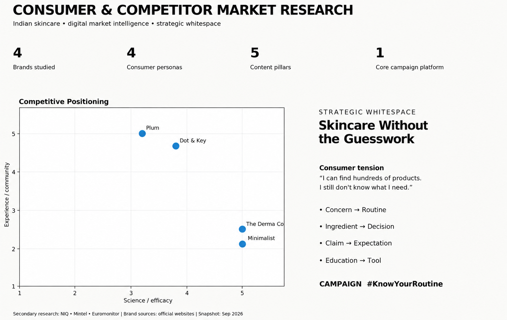

# ✦ PEOPLE → INSIGHTS → IDEAS → IMPACT ✦

### Exploring how brands connect with people — through creativity, strategy & data.

`DIGITAL MARKETING` · `CONSUMER INSIGHTS` · `CONTENT` · `STRATEGY` · `ANALYTICS`

---

Hi, I'm Neha 👋

I've always found it interesting how much thought goes into something as simple as seeing a product on our screen and deciding whether to stop, click,
explore, or buy.

That curiosity is what pulled me towards digital marketing.

I built the projects in this portfolio to explore those questions myself.

Rather than following the same approach for every project, I wanted to look at digital marketing from different angles — from building a campaign, to
finding marketing insights in sales data, 
to researching consumers andcompetitors and developing a strategy from those insights.

I'm still learning, experimenting, and figuring out what kind of marketer I want to become. That's also what makes digital marketing interesting to me: there is always something new to understand, test, and improve.

And that is where I want to take this interest further — by working on real brands, real audiences, and real marketing challenges, while continuing to learn, experiment, and build along the way.

---

## ✦ What I'm Exploring

Digital marketing interests me because it brings together **people, creativity,
strategy, and data**.

While building these projects, I kept exploring a few questions:

> **What makes a campaign work?**  
> **What can customer behavior tell us?**  
> **Why does one brand stand out from another?**  
> **How can an insight become a marketing idea?**

These questions shaped the projects below.

---

# 🚀 Projects

## 01 — AI Marketing Campaign

**Campaign strategy • Audience segmentation • Content • Performance**

A complete digital campaign case study for a fictional skincare brand,
covering audience research, campaign planning, content, ad copy, and
performance measurement.

**Key takeaway:** I learned how audience, message, channel, and measurement
work together to shape a campaign.

**[→ View Project](./AI_Marketing_Campaign)**

---

## 02 — Pizza Sales Marketing Analytics 🍕

**Customer behavior • Product insights • Marketing opportunities**

I explored sales and ordering patterns to understand customer behavior,
product preferences, peak demand, and possible promotional opportunities.

**Key takeaway:** I learned how customer and sales data can be turned into
practical marketing insights.

**[→ View Project](./Pizza_Sales_Marketing_Analytics)**

---

## 03 — Consumer & Competitor Market Research

**Consumer insights • Competitor research • Positioning • Strategy**

A research-led exploration of the Indian skincare market, looking at
consumers, competitors, digital presence, market gaps, and content
opportunities.

**Strategic idea:** **"Skincare Without the Guesswork"**  
**Campaign:** `#KnowYourRoutine`

**Key takeaway:** I learned how consumer and competitor research can shape
positioning, content, and campaign strategy.

**[→ View Project](./Consumer_Competitor_Market_Research)**

---

# 🧠 What I'm Taking Forward

These projects have taught me that good marketing is a balance of:

**Understanding people → Finding insights → Creating ideas → Measuring impact**

I'm especially interested in **digital marketing, consumer insights,
marketing analytics, content strategy, and campaign planning**.

---

# 🛠️ Skills

**Marketing:** Campaign Planning · Content Strategy · Consumer Research ·
Competitor Analysis · Marketing KPIs

**Analytics:** Python · Excel · Power BI · Tableau · MySQL

**Strategy:** Consumer Personas · Customer Journey · Positioning · SWOT ·
Market Gap Analysis

---
# 🌱 What's Next

I'm looking to build my career in **Digital Marketing**, especially in
**Digital Marketing, Marketing Analytics, Content & Social Media, Consumer
Research, and Growth Marketing**.

I'm excited to work on real brands, audiences, and marketing challenges while
bringing together **creativity, strategy, and data**.
---

# 📫 Let's Connect

**Email:** nshinge329@gmail.com 
**GitHub:** [Neha664](https://github.com/Neha664)
